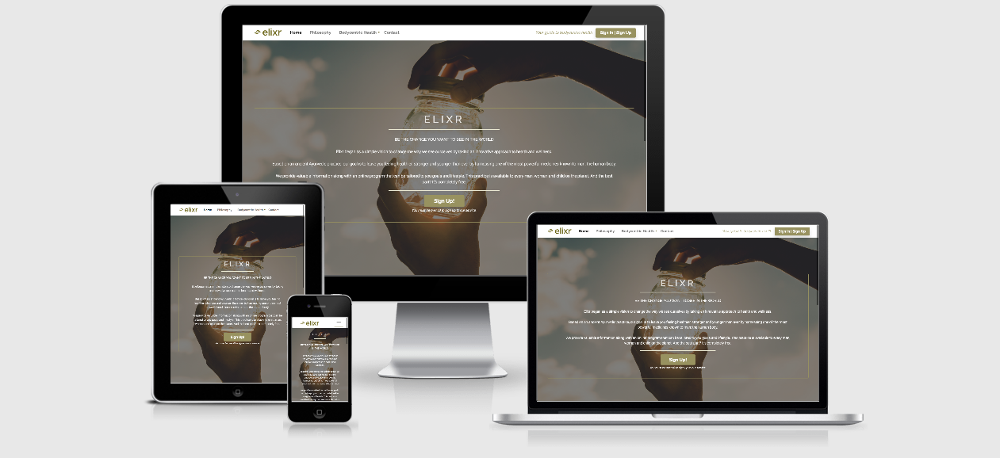

# Milestone Project 1 - User Centric Front End Development

# Elixr | Bodycentric Healing

I have decided to use this project as an opportunity to explore my research into the 
subject of alternative health and wellbeing and to present the ideas, practices and 
findings as information to the user.

The site will eventually include tailored health programmes, exclusive guides
and a unique members area for registered users/clients.

The business objective of this website is based on free information and practices for the client.
However, in order to monetise the site and run a business from it, the members area will be accessed
by a paid subscription, it will also feature video courses and affiliate links to
products that are relevant to the info product information.

***

## UX

As the subject of the project is my own research into alternative health practices, the 
primary demographic of users will be people interested in learning more about such practices,
and to learn and experiment safely for themselves. As this information is relevant to a very
wide demographic (anybody with a body, interested in health) the UX had to remain simplistic,
yet informative and to include easy to follow links to pages.

I have identified three main potential users of the site:

### User Stories

#### Potential Clients

As a potential client, I would like to be able to clearly understand complex topics and 
so that I can sign up for and be confident of the information I will recieve.

#### Potential Academic Peers

As a potential academic peer, I would like to be able to learn more about research developments
so I can contribute to further research and to the blog and forum.

#### Casual User

As a casual user, I would like to be able to navigate each page easily, 
so that I am able to the enjoy the content without worrying getting lost.

High-resolution wireframes can be found [here](wireframes/milestone-project-1_elixr.pdf).

***

## Features

### Existing Features

* Fixed navigation bar with links to all pages

* Page sections with smooth scroll-behaviour

* Easy to locate signup buttons for user registration

* Contact form

* Mobile responsive down to 320px

* Information page including brief introductions to members content (registration incentive)

* Links to social media in footer

### Features Left to Implememnt

* Members-only area

* Mailing list modal

* Embedded video courses

* Floating social-links with share option

***

## Technologies Used

* [Github](https://www.github.com/) - Used for hosting and version control.

* [Gitpod](https://www.gitpod.io/) - IDE used for writing site source code.

* [Balsamiq](https://www.balsamiq.com) - Blasamiq cloud used for creating wireframes/high resolution mockups.

* [Google Developer Tools - Inspect](https://www.google.com/chrome/) - Used for testing code and bug fixes.

* [Bootstrap](https://getbootstrap.com/) - CDN framework used for layout structure and elements.

* [Font Awesome](https://fontawesome.com/) - Used for icon library for social links.

* [Google Fonts](https://fonts.google.com/) - Raleway and Roboto has been used throughout this project.

* [Adobe Stock](https://www.stock.adobe.com) - Used public domain images for site background and stock images.

* [Adobe Color Wheel](https://color.adobe.com/create/color-wheel) - Used to create a color pallette for site.

* [Markup Validation](https://validator.w3.org/) - Used to validate HTML code.

* [CSS Validation](https://jigsaw.w3.org/css-validator/) - Used to validate CSS code.

* [Am I Responive?](http://ami.responsivedesign.is/) - Used to quickly see how the repsonsive design looked across all media .

***

## Testing

Throughout the project I tested functionality and fixed bugs using Google Chrome's developer tools to check CSS
and also to make the website as responsive as possible. I used Bootstrap 4's grid layout system to achieve the
basic layout for the site which made mobile first development a bit easier. However certain elements were tricky to
get right for mobile responsiveness under 576px and media queries were used to quickly solve this.  
As I was using a lot of Bootstrap's elements and classes, I frequently referenced Bootstrap's source CSS code on github
in order to build my own CSS based on that.

### Testing Scenarios

1. Home page - philosophy section
    * Scroll to bottom of page/click on "Philosophy" nav button on header.
    * From other pages, click on "Philosophy" nav button on header.
    * Use "Back to Top" button in footer to return to the top of the page.

2. Sign up/Sign in
    * Click on Sign up/Sign in button in right of header to access signup modal.
    * Click on Sign up/Sign in button in home page jumbotron to access signup modal.
    * For smaller screen sizes, button in header is not displayed, however it is still available in the main jumbotron.

3. Access information page(bodycentric-health.html)
    * Page can be accessed via dropdown menu in navbar, "About" will take the user to the top of the page,
    and any other options will be linked to the relevant sections within the page.
    * Use "Back to Top" button in footer to return to the top of the page.

4. Contact form 
    * Click on "Contact" link in navbar to be taken to contact page.
    * Form inputs and message will be required.
    * Click "Submit" button to send the message.

5. Access social media
    * Social media pages can be accessed via the button links in the page footer.

***

## Deployment

My site has been deployed on github pages. The site can be found [here](https://vdgvzr.github.io/milestone-project-1/)

***

## Credits

### Media:

* Logo was created using [Canva](canva.com) logo creator.

* All images used can be found [here](stock.adobe.com) at Adobe's free stock image site.

### Acknowledgements

* I took inspiration from my version of the "Whiskey Drop" project done via the code institute course for the basic page layout for the site.